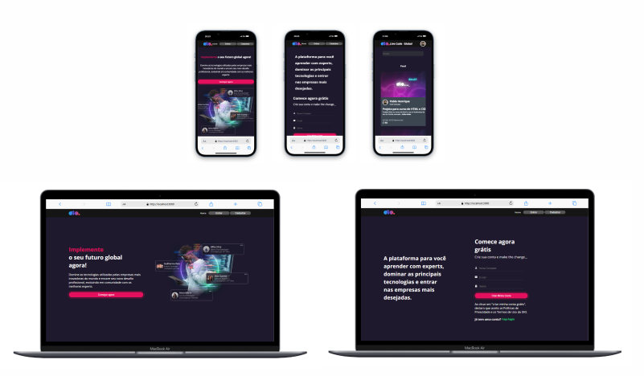

# ⚡ Projeto - DIO - REACT

## 🚀 Bem-vindo ao projeto DIO!

Este projeto foi desenvolvido com:

- **🌐 React**
- **🎨 Styled-Components**
- **🔗 API RESTful: API simulada com json-server para testes e desenvolvimento**

## Instruções para rodar o projeto

Antes de começar, certifique-se de ter o **Node.js** e o **npm** instalados em seu ambiente de desenvolvimento.

- **Node.js**: [Baixar Node.js](https://nodejs.org/)
- **npm** (gerenciador de pacotes do Node.js): Geralmente instalado junto com o Node.js

### 1. Baixar ou clonar o projeto

Baixe ou clone o repositório do GitHub. Depois, navegue até a pasta do projeto:

```bash
cd dio-clone-main
```

### 2. Instalar as dependências e as bibliotecas:
Instale as dependências necessárias do projeto utilizando o npm:

```bash
npm install
```

```bash
npm install react-scripts
```

```bash
npm install react-router-dom
```

```bash
npm install styled-components
```

### 3. Instalar o APi Rest Full
#### Instale o json-server globalmente, uma ferramenta que cria uma API REST Full simulada a partir de um arquivo JSON, permitindo a criação rápida de um servidor para testes:
Esse comando instala o json-server globalmente no seu sistema. O json-server é uma ferramenta que cria uma API RESTful simulada usando um arquivo JSON como banco de dados, permitindo que você crie rapidamente um servidor de desenvolvimento para testes:

```bash
npm install -g json-server
```

### 4. Iniciar a API Rest Full Json
#### Inicie o servidor da API RESTful simulada, que utilizará o arquivo db.json como banco de dados para os testes:
Esse comando instala o json-server globalmente no seu sistema. O json-server é uma ferramenta que cria uma API RESTful simulada usando um arquivo JSON como banco de dados, permitindo que você crie rapidamente um servidor de desenvolvimento para testes:

```bash
npm run api
```

### 5. Iniciar o servidor de desenvolvimento
Após a instalação das dependências, abrir um segundo terminal e execute o comando abaixo para iniciar o servidor de desenvolvimento:

```bash
npm start
```
Isso vai iniciar o projeto, e você poderá acessá-lo no navegador, geralmente em http://localhost:3000 (ou outra porta, caso configurada).

## Mais Detalhes sobre o Projeto
####  A tipagem dos dados foi realizada utilizando a extensão .tsx (TypeScript com React).
Este projeto é totalmente responsivo, adaptando-se a diferentes tamanhos de tela e dispositivos.



#### Muito aprendizado, novidades e atualizações incríveis com a DIO 🚀
